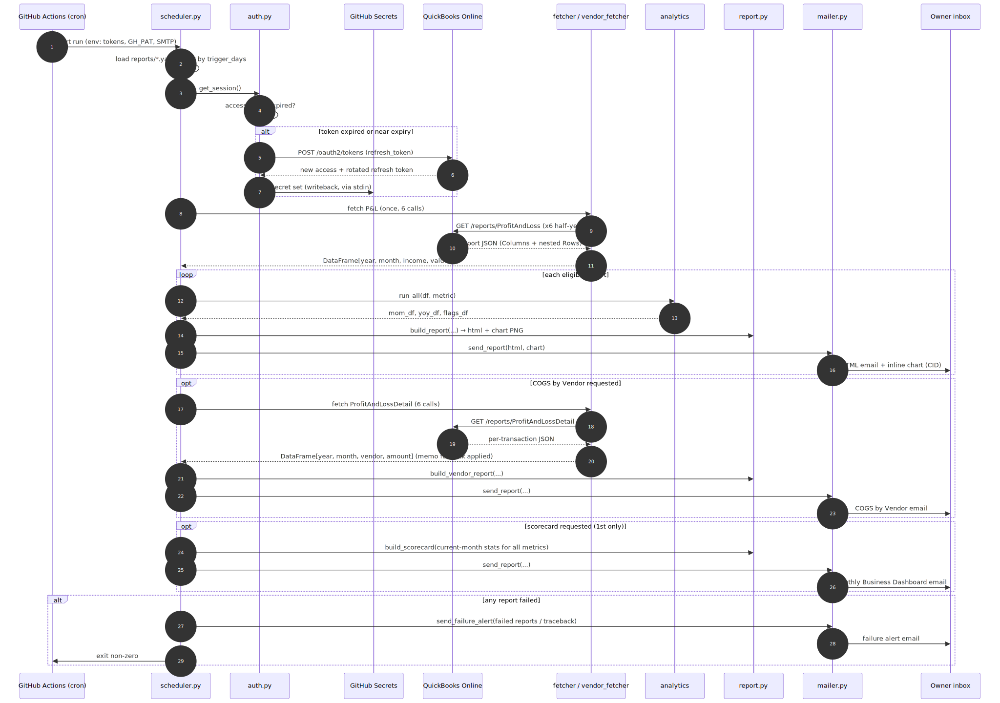
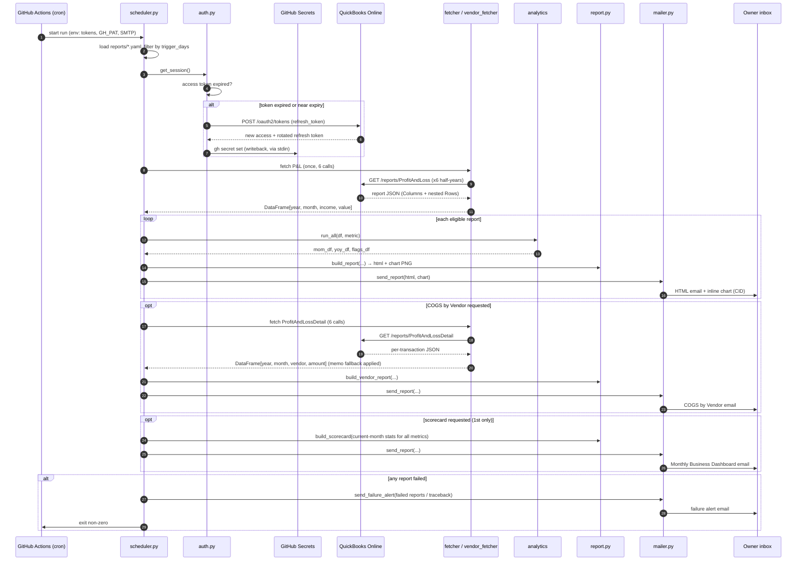
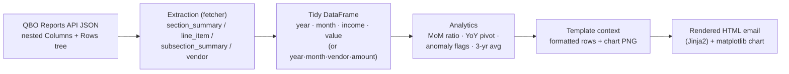

# Data Flow

How data moves from the QuickBooks ledger to the owner's inbox on each run, and
how the data is shaped at each hop.

## End-to-end sequence

Diagram source (Mermaid)

## Data transformation pipeline

How a single metric's data is reshaped from raw API JSON to a rendered email:

Diagram source (Mermaid)

## Data shapes at each stage

| Stage | Shape | Notes |
|---|---|---|
| **QBO ProfitAndLoss** | Nested JSON: `Columns[]` (months) + `Rows.Row[]` tree of Sections/Data | Months parsed from column titles (`"Jan 2026"`); the trailing "Total" column is dropped |
| **QBO ProfitAndLossDetail** | Flat transaction rows under each account section | Columns include Date, Payee (`name`), Memo, Split, Amount |
| **Summary DataFrame** | `year, month, income, value` (long) | One row per month per year; 3 years × 12 months |
| **Vendor DataFrame** | `year, month, vendor, amount` (long) | Vendor = Payee, else memo-derived, else "Unattributed"; aliases applied; grouped/summed |
| **MoM frame** | current-year months with `value_pct` | Zero-income months → NaN pct |
| **YoY frame** | one row per month, per-year `income_/value_/value_pct_` columns | Tolerates missing years |
| **Flags frame** | only flagged months: deviation, direction | Empty when within threshold or no history |
| **Email** | `multipart/related` HTML + inline PNG (`cid:monthly_chart`) | CID inline so Gmail renders the chart |

## Why two fetch paths

- **Summary (`ProfitAndLoss`)** drives the 8 metric reports and the scorecard. Section
  totals are read directly — efficient, one shared fetch per run.
- **Detail (`ProfitAndLossDetail`)** is required only for COGS-by-Vendor, because only
  the detail report breaks each transaction out by vendor under its expense account.
  It is fetched lazily — only when a `vendor_breakdown` report is in scope.

## State that survives between runs

Nothing is cached on disk between runs (the runner is ephemeral). The only persisted
state is:

- **GitHub Secrets** — the rotating QBO tokens (refreshed and written back each run).
- **QuickBooks Online** — the ledger itself, always re-read fresh.

This makes every run self-contained and idempotent with respect to reading: a run can
be repeated safely (it re-reads and re-sends), and the token chain is the only mutable
state it maintains.
