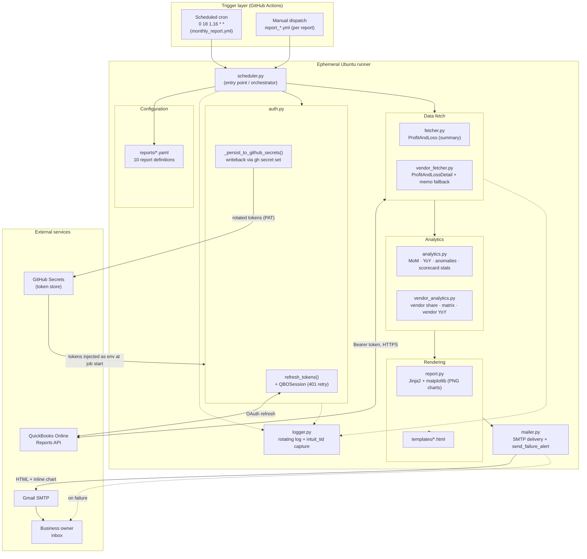

# Solution Architecture

The system is a config-driven, serverless reporting pipeline. There is no
always-on server: a scheduled GitHub Actions job is the only compute, and it runs
to completion and exits. All state between runs lives in GitHub Secrets (tokens)
and the QuickBooks Online ledger (the source of truth).

## Component diagram

## Key architectural decisions

| Decision | Rationale |
|---|---|
| **Serverless / cron, not a webhook** | The job is a periodic snapshot, not event-driven. No server to host, patch, or keep alive. |
| **Fetch P&L once per run** | One 6-call fetch feeds all summary reports; the vendor report adds its own detail fetch only when needed. Avoids hammering the QBO API. |
| **Config-driven reports** | Adding a metric is a YAML file, not code. Extraction strategy (`section_summary` / `line_item` / `subsection_summary` / `vendor_breakdown`) is declared per report. |
| **Token writeback to GitHub Secrets** | Runners are ephemeral; the rotated refresh token must persist somewhere durable the next run can read. Secrets are the store; a PAT grants write. |
| **Failure alerting in two layers** | In-process alerts give detail (which report, traceback); a workflow-level `if: failure()` net catches what the process can't self-report. |
| **`intuit_tid` on every call** | Captured in logs so any QBO support ticket can reference the exact transaction id. |
| **Per-report manual workflows** | Each report can be re-run on demand without waiting for the schedule; the combined cron run respects `trigger_days`. |

## Trust & secrets boundary

- **QBO OAuth tokens** (access/refresh/expiry) and **SMTP credentials** live only in
  GitHub Secrets, injected as environment variables at job start.
- **`GH_PAT`** (fine-grained, `Secrets: write` + `Metadata: read`) is the only
  credential that cannot auto-rotate; it authorizes the token writeback. See the
  runbook in the README for its expiry/recovery procedure.
- Tokens are fed to `gh secret set` via **stdin**, never on the command line, so they
  never appear in the runner's process arguments.
- `.env` is git-ignored; secrets never enter the repo.
